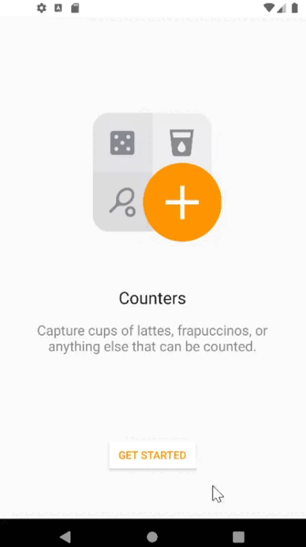

# Cornershop Android Development Test




## Technical details

### Android Studio Artic Fox 2020.3.1 patch 3

Android Project MVVM Clean Architecture 4 Layers.

Relevant Tech implemented:

- Koin
- Coroutines
- LiveData
- Mockito
- Share Preferences
- Retrofit
- Gson

Complexity in order to demonstrate knowledge over architecture, decoupling and scalability capabilities


## Code Standards and Definitions

- Follow the **MVVM** architecture pattern

- Follow the package patterns by
  - Views in **presentation**
  - ViewModels in **viewmodel**
  - Models in **model**
  - Business, validations, use cases in **domain**
  - Persistence, network requests, raw model, mappers ... in **data**
  - Dependency injection in **di**

# Test definitions and instructions

## Before you begin
You will need to fork this repo and use `/test` as a template, in there you already have all the resources (colors, strings, dimens, etc.), please make sure you read and understand all the requirements in this README. When you finish your test, add your recruiter to your fork and let them know you are done.

If you have any questions, please reach your recruiter, specially if they are related to UI design.

## The test
Create an Android app for counting things. You'll need to meet high expectations for quality and functionality. It must meet at least the following:

* **States are crucial**, you must handle each state transition properly
* Add a named counter to a list of counters.
* Increment any of the counters.
* Decrement any of the counters.
* Delete a counter.
* Show a sum of all the counter values.
* Search counters.
* Enable sharing counters.
* Handle batch deletion.
* Unreliable networks are a thing. State management and error handling is **important**.
* Persist data back to the server.
* Must **not** feel like a learning exercise. Think you're building it to publish for the Google Play Store.

#### Build this app using the following spec: https://www.figma.com/file/qBcG5Poxunyct1HEyvERXN/Counters-for-Android

Some other important notes:

* Showing off the knowledge of mobile architectures is essential.
* Offer support to Android API >= 21.
* We expect at least some Unit tests.
* The app should persist the counter list if the network is not available (i.e Airplane Mode).
* Create incremental commits instead of a single commit with the whole project
* **Test your app to the latest Android API**

Bonus points:
* Avoid God activities/fragments.
* Minimal use of external dependencies.
* Handle orientation changes.


**Remember**: The UI is super important. Don't build anything that doesn't feel right for Android.


## Install and start the server
On **[server](server)** folder run the following commands:

```
$ npm install
$ npm start
```

## API endpoints / examples

> The following endpoints are expecting a `Content-Type: application/json`

```
GET /api/v1/counters
# []

POST /api/v1/counter
Request Body:
# {title: "bob"}

Response Body:
# [
#   {id: "asdf", title: "bob", count: 0}
# ]


POST /api/v1/counter
Request Body:
# {title: "steve"}

Response Body:
# [
#   {id: "asdf", title: "bob", count: 0},
#   {id: "qwer", title: "steve", count: 0}
# ]


POST /api/v1/counter/inc
Request Body:
# {id: "asdf"}

Response Body:
# [
#   {id: "asdf", title: "bob", count: 1},
#   {id: "qwer", title: "steve", count: 0}
# ]


POST /api/v1/counter/dec
Request Body:
# {id: "qwer"}

Response Body:
# [
#   {id: "asdf", title: "bob", count: 1},
#   {id: "qwer", title: "steve", count: 2}
# ]


DELETE /api/v1/counter
Request Body:
# {id: "qwer"}

Response Body:
# [
#   {id: "asdf", title: "bob", count: 1}
# ]


GET /api/v1/counters
Response Body:
# [
#   {id: "asdf", title: "bob", count: 1},
# ]
```

> **NOTE:* Each request returns the current state of all counters.

